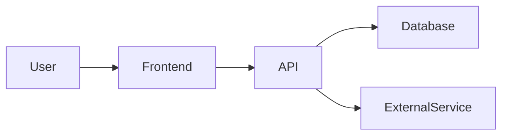
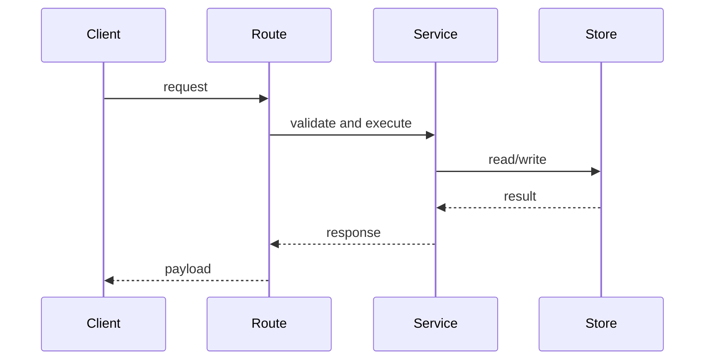

# Explain Repo

## Overview

Produce an evidence-based repository explanation in three layers: 1000 foot, 100 foot, and 10 foot. Optimize for onboarding a technical reader who will use coding agents to contribute to the repo.

## Workflow

1. Inspect the repository before explaining it.
2. Identify the stack, entry points, package/build tools, runtime boundaries, tests, and deployment clues.
3. Trace how the main components interact by reading source files, configs, routes, schemas, services, and scripts.
4. Produce a three-level explanation using the report structure below.
5. Include file references for important claims. If something is inferred rather than directly shown in code, label it as an inference.

Do not rely only on filenames or README text. Confirm key claims against source code or configuration where practical.

## Discovery Checklist

Start with a focused pass over:

- Repo documentation: `README*`, `CONTRIBUTING*`, `CLAUDE.md`, `AGENTS.md`, architecture docs.
- Package and build config: `package.json`, lockfiles, workspace files, framework config, compiler config, test config.
- App entry points: routes, pages, server files, CLIs, worker entry points, mobile/native app roots.
- Data layer: schemas, migrations, ORM config, API clients, persistence helpers.
- Integration layer: external services, auth, payments, messaging, background jobs, webhooks.
- Quality tooling: test directories, lint/typecheck commands, CI workflows, scripts.

Adjust the pass to the repo. For example, a library may need exports and examples more than routes; an infrastructure repo may need Terraform modules and environment wiring more than application components.

## Report Structure

Use this structure unless the user asks for a different format.

### 1000 Foot View

Explain:

- What the repo does and who/what it serves.
- The primary product or system capabilities.
- The main frameworks, languages, runtimes, package managers, and build tools.
- The broad architecture shape, such as frontend app, backend API, worker system, CLI, library, monorepo, or deployment bundle.

Keep this section high level and readable by a technical stakeholder who has not opened the code.

### 100 Foot View

Explain how the main components interact:

- List the major components/modules and their responsibilities.
- Describe request/data/control flow between components.
- Note important shared abstractions, boundaries, conventions, and integration points.
- Include Mermaid diagrams for the important layers. Use as many diagrams as needed, but keep each diagram focused.

Prefer diagrams such as:

Use real component names from the repo instead of generic placeholders in the final answer.

### 10 Foot View

Give enough detail for someone to contribute with coding agents:

- Repository map: important directories/files and what each owns.
- Local setup: install, build, test, lint, typecheck, run, seed/migrate, and common environment variables when discoverable.
- Contribution workflow: where to start for common changes, how to trace code paths, and what files likely need edits for each change type.
- Component deep dives: for each important component, include its responsibilities, key files, public interfaces, data contracts, dependencies, and tests.
- Risk areas: fragile flows, hidden coupling, generated files, migrations, auth/security boundaries, async jobs, external API assumptions, deployment concerns.
- Agent-ready task guidance: examples of well-scoped implementation prompts a coding agent could run, plus what verification commands or browser checks should follow.

## Quality Bar

- Be specific. Prefer "the API client lives in `src/lib/api.ts` and is used by route loaders" over "there is an API layer."
- Distinguish confirmed facts from inferences.
- Mention uncertainty and missing docs instead of filling gaps with confident guesses.
- Avoid exhaustive file-by-file narration. Prioritize files that explain architecture, behavior, or contribution paths.
- Include commands only after confirming them from repo docs or config when possible.
- If the repo is large, state what you sampled and what still deserves deeper inspection.
